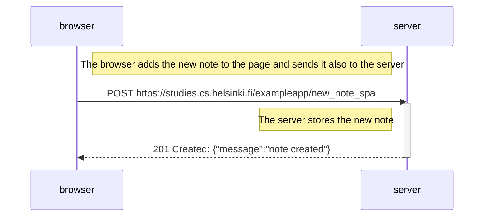

```mermaid
sequenceDiagram
    participant browser
    participant server

    Note right of browser: The browser adds the new note to the page and sends it also to the server

    browser->>server: POST https://studies.cs.helsinki.fi/exampleapp/new_note_spa
    activate server
    Note left of server: The server stores the new note
    server-->>browser: 201 Created: {"message":"note created"}
    deactivate server
```
